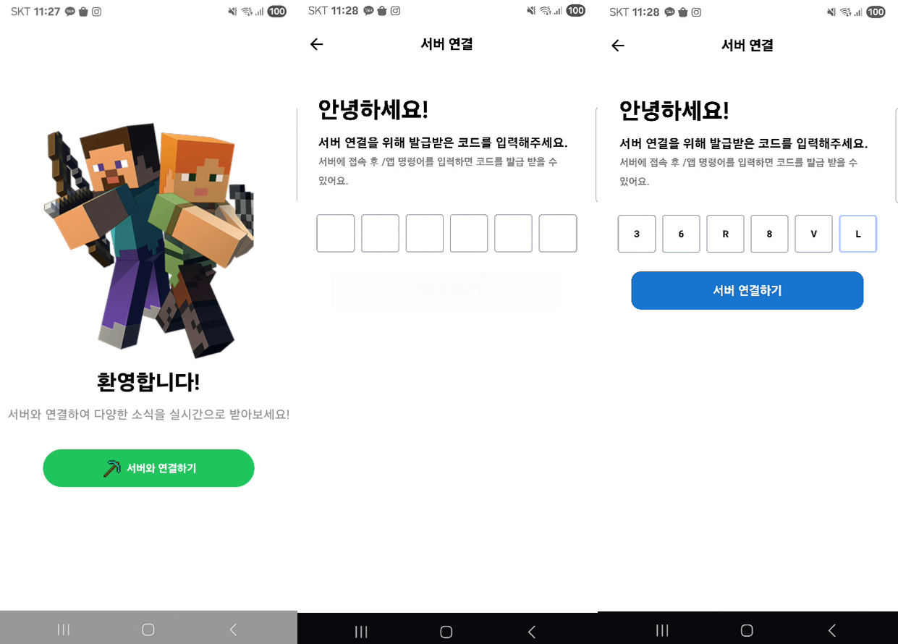
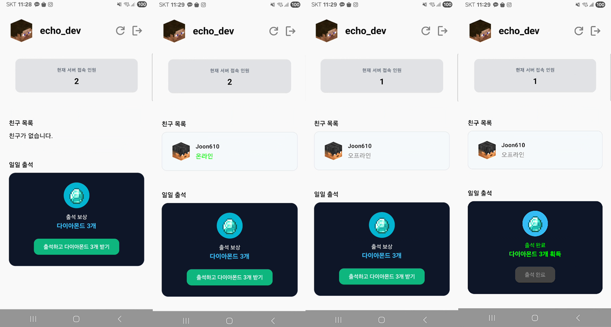

## 서비스
> 마인크래프트 서버 전용 커뮤니티 앱

## 앱 화면

## 앱 소개
- 사용자는 서버로부터 앱 연동 코드를 받아 앱과 마인크래프트 계정을 연결합니다.
- 앱에서 출석체크를 통해 서버에서 보상 아이템을 수령할 수 있습니다.
- 서버 내 친구로 등록된 플레이어의 온라인/오프라인 상태를 앱에서 확인할 수 있습니다.
- 서버의 현재 접속 인원을 확인할 수 있습니다.

## 시연 영상
https://drive.google.com/file/d/1RgdM1-WDPuzeeV6DgLg8pXXp9AxW3vcB/view?usp=sharing

## 구현 기능 목록
### 1. 로그인
- [x] 로그인 UI 구현하기
- [x] 연결 코드 입력하기
- [x] 데이터베이스에 저장된 연결 코드와 일치하는 문서 있는지 검증
- [x] 검증 성공 후 연결 코드와 연결된 UUID 가져오기
- [x] UUID를 기기 로컬 데이터베이스에 저장하기
### 2. 프로필 불러오기
- [x] 프로필 UI 구현하기
- [x] 로컬 데이터베이스에 UUID 저장 여부 확인
- [x] 저장되어 있을 시 Mojang API를 사용해 닉네임 불러오기
- [x] crafatar API를 사용해 플레이어 스킨 불러오기
### 3. 친구 목록 불러오기
- [x] 친구목록 UI 구현하기
- [x] 파이어베이스에 사용자의 UUID에 저장된 친구 UUID 리스트로 불러오기
- [x] 리스트마다 Mojang API 사용하여 친구의 닉네임 가져오기
- [x] crafatar API 사용하여 친구 플레이어 스킨 가져오기
- [x] 서버 API를 사용해 친구의 서버 온라인 상태 가져오기

### 4. 출석체크 
- [x] 마지막 출석체크 날짜 확인하기
- [x] 마지막 출석체크 날짜가 오늘이면 출석체크 완료 UI 출력
- [x] 출석체크 UI 구현하기
- [x] 로그인 된 UUID로 서버에 POST 요청 보내기

### 5. 로그아웃
- [x] 로그아웃 UI 구현하기
- [x] 로그아웃 기능 구현하기
